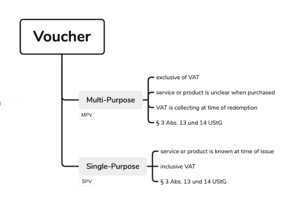

# fanzVOUCHER documentation

## Definition of a voucher

A voucher is a document or electronic medium that represents a certain value and can be exchanged for goods, services or discounts from the seller or service provider. The value of a voucher is usually paid in advance, and the voucher is then redeemed at a later date.

Vouchers are often used as gifts or issued by companies as part of promotions, customer loyalty programs, or as compensation. They may apply to specific products or services (as in a single-purpose voucher) or be used for a variety of products or services (as in a multipurpose voucher).

Vouchers can exist in physical form (such as paper or plastic card) or in digital form (such as an emailed code or digital gift card). They can be redeemed at a specific merchant or at a group of merchants, depending on the terms of the voucher.

## Classification of fanzVOUCHER system

The fanzVOUCHER system (fVS) is an independent service that integrates seamlessly into the cosmos of existing fanz services.

With the fVS, we give our customers another building block for customer loyalty.

fanzVOUCHER and fanzLOYALTY are a "perfect match".

## Legal framework

As of April 2024, we refer only to the applicable regulators of Germany. In Germany, the decisive factor is the Value Added Tax Act (Umsatzsteuergesetz, USt).

In the future, we will ensure that the legal frameworks of other countries - especially EU countries - are applied.

## Vouchers

There are two types of vouchers: single-purpose voucher (SPV) and multi-purpose voucher (MPV).

### Single purpose voucher

!!! warning "Not supported"

    By April 2024 fanzVOUCHER **does not** support Single Purpose Voucher

A Single-Purpose Voucher is a voucher where all the information needed for calculating the VAT is known at the time of issue. This means the place and type of service as well as the applicable VAT rate are already fixed. Therefore, VAT is collected at the time of the voucher's sale. A typical example would be a voucher for a specific book at a bookstore. In this case, it's already clear at the time of issue which book will be bought and what VAT rate will be applied.

#### Example 

Imagine you buy a voucher that is specifically for the "Margherita Pizza" in the restaurant "Bella Italia". When you purchase this voucher, it is already clear which service (the Margherita Pizza) and where this service is provided ("Bella Italia"). The applicable sales tax rate is also already known. In Germany, this would be the reduced VAT rate for takeaway food.

The voucher can only be used for this specific purpose, therefore it is a single purpose voucher. Since all the details are already known at the time the voucher is purchased, the sales tax is already charged at that time.

Let's assume that the voucher for Margherita Pizza costs 10 euros and the applicable VAT rate is 7% (the reduced rate in Germany for certain takeaway meals). The buyer of the voucher pays 10 euros, and this 10 euros already includes the sales tax.

The invoice could look like this:

- Net amount (price without sales tax): 9,35 euros
- Sales tax (7% on the net amount): 0,65 euros
- Gross amount (net amount plus sales tax): 10,00 euros

So the buyer pays 10 euros when buying the voucher, and these 10 euros already include the sales tax of 0,65 euros.

When redeeming the voucher for the Margherita Pizza, no additional sales tax will be charged, since the sales tax has already been paid when the voucher was purchased.

### Multi purpose voucher

!!! success "Supported voucher type"

    By April 2024 fanzVOUCHER is enabled to work with this type of voucher only!

A Multi-Purpose Voucher is a voucher where not all the information needed for calculating the VAT is known at the time of issue. This means it's still unclear what exact service or product will be purchased with it and how much VAT will be due. Therefore, VAT is only collected at the time of redemption. A typical example would be a shopping mall gift card that can be redeemed at various stores and for different goods and services.

#### Example

Imagine you buy a voucher for the "ABC Shopping Center" worth 100 euros. This voucher can be redeemed in any store within the shopping center, regardless of whether you want to buy clothes, jewelry, electronics, books or food. For each of these stores, the applicable sales tax rate may be different. Some items could be taxed at the reduced sales tax rate (e.g. books in Germany) and others at the regular sales tax rate.

Since it is not yet clear when the voucher is purchased, what exact service is being purchased and what sales tax rate applies, the sales tax is not charged until the voucher is redeemed. Therefore, the voucher is a multi-purpose voucher.

In the purchase invoice for the voucher, it looks like this:

- Voucher value: 100 euros
- Value added tax: 0 euros
- Total amount to be paid: 100 euros

So the buyer pays 100 euros when purchasing the voucher, and this amount does not yet include sales tax. Sales tax is not calculated and due until the voucher is redeemed and the specific goods or services purchased with it are known.
